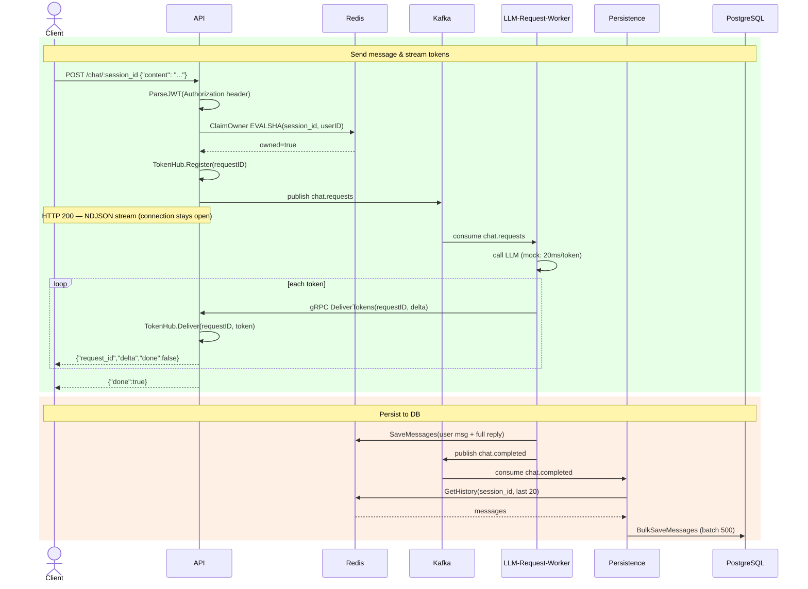
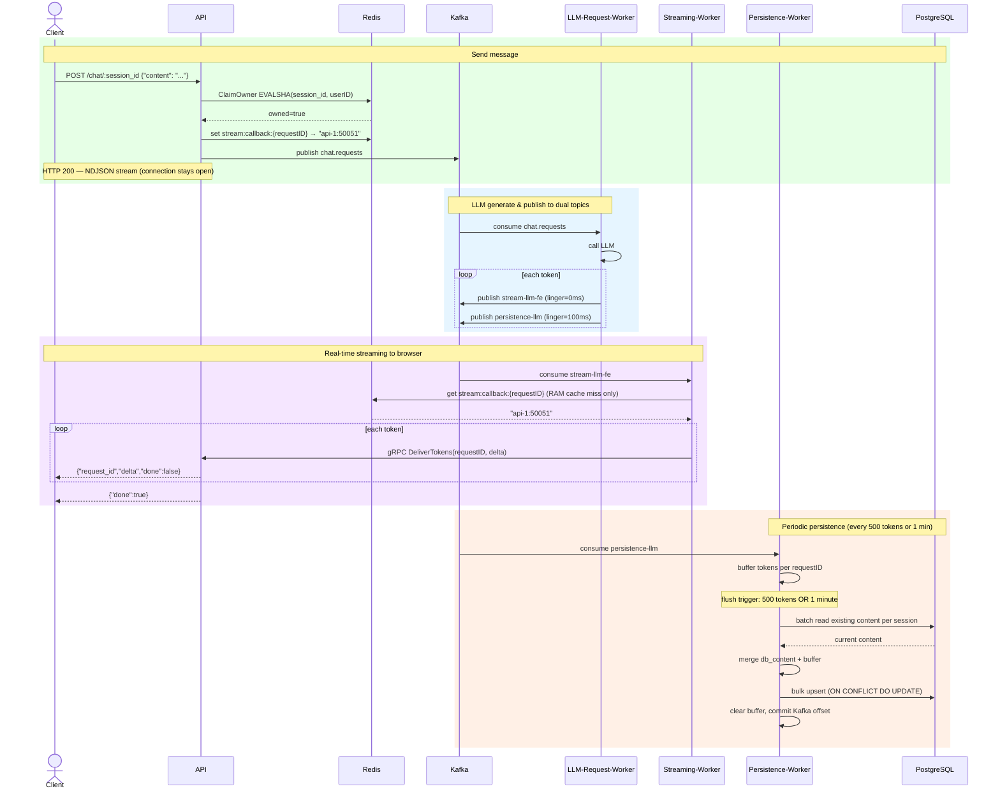

# golang-learning

A Go project for testing event-driven LLM streaming architecture at scale.

## Current Architecture

### Data Flow

```
POST /chat/:session_id
  │
  ├── API: ClaimOwner (Redis) + Register TokenHub + publish chat.requests (Kafka)
  │
  └── LLM-Request-Worker: consume chat.requests → call LLM → gRPC stream tokens → API TokenHub
                                                                                       │
                                                                           API → NDJSON stream → Browser

chat.completed (Kafka) → Persistence → Redis GetHistory → PostgreSQL bulk upsert
```

### Sequence Diagram



### Services

| Service | Role |
|---|---|
| **API** | Gin HTTP, JWT auth, NDJSON streaming, gRPC server (TokenHub) |
| **LLM-Request-Worker** | Kafka consumer, LLM call, gRPC client stream tokens to API |
| **Persistence** | Kafka consumer on `chat.completed`, batch upsert to PostgreSQL |

### Infrastructure Tuning (current)

| Component | Config | Reason |
|---|---|---|
| LLM-Request-Worker | 2 replicas, 2 CPU each | Kafka partition parallelism |
| gRPC | `MaxConcurrentStreams=1000` | Handle concurrent token streams |
| gRPC conn | Shared per worker (reused) | Eliminate per-request connection overhead |
| Redis | Single-threaded (no io-threads) | Low ops/sec — threading overhead > benefit |
| Redis ZRange | Last 20 messages | Prevent unbounded history reads |
| Kafka | 2 partitions per topic | Match worker replica count |
| Persistence batch | 500 events | Reduce DB round trips |
| Locust | 1 master + 4 workers | Bypass Python GIL for load generation |

### Performance Results

| Metric | Value |
|---|---|
| RPS | ~800 |
| Bottleneck | API CPU (83%) |
| Worker CPU | ~30% (IO-bound, MockLLM sleeps) |
| Redis CPU | ~17% (single-threaded) |
| Kafka lag | ~744 messages (normal in-flight) |

---

## Planned Architecture

Separating real-time streaming from persistence using dual Kafka topics with different producer configs.

### Data Flow

```
LLM Worker: generate token
  ├── publish stream-llm-fe   (linger=0ms, small batch)   → Streaming Worker
  └── publish persistence-llm (linger=100ms, large batch) → Persistence Worker

Streaming Worker:
  consume stream-llm-fe
  → Redis lookup: requestID → API instance address (cache in RAM)
  → gRPC stream → correct API instance → Browser

Persistence Worker:
  consume persistence-llm
  → buffer tokens per requestID in memory
  → flush every 500 tokens OR 1 minute:
      read DB for existing content per session (batch)
      merge: db_content + buffer_content
      bulk upsert PostgreSQL
      clear buffer
      commit Kafka offset
```

### Sequence Diagram



### Why Dual Topics

| Topic | Optimization | Config |
|---|---|---|
| `stream-llm-fe` | Latency — token reaches browser fast | `linger.ms=0`, small batch |
| `persistence-llm` | Throughput — efficient DB writes | `linger.ms=100`, large batch, compression |

### Routing: Redis Callback

With multiple API instances, Streaming Worker needs to know which instance holds the TokenHub for a given requestID:

```
API on request:   Redis.set(stream:callback:{requestID} → "api-1:50051", TTL=5min)
Streaming Worker: RAM cache[requestID] hit? → use it
                  RAM miss → Redis.get(requestID) → cache → gRPC to correct instance
```

### Persistence: Partial Save + Durability

Tokens are flushed periodically — not waiting for `done` — so partial content is saved even if worker crashes mid-generation.

```
Worker crash at token 8/12:
  tokens 1-8 already in persistence-llm Kafka → safe
  Persistence flushes partial content to DB
  User refresh → sees "Hello world how are" (partial but consistent with what they saw)

Persistence crash + restart:
  Kafka replay from last committed offset
  Next flush: read DB (previous flushes) + buffer (replayed tokens) → merge → upsert
```

Upsert strategy — replace on conflict, not append:
```sql
INSERT INTO messages (session_id, request_id, role, content)
VALUES (...)
ON CONFLICT (request_id, role) DO UPDATE
SET content = EXCLUDED.content
```

Idempotent on Kafka replay — overwriting with same or more complete content.

---

## Tech Stack

| Layer | Technology |
|---|---|
| HTTP streaming | Gin (NDJSON chunked transfer) |
| Token delivery | gRPC client streaming (worker → API) |
| Event bus | Kafka |
| Session cache | Redis (sorted set, Lua ownership claim) |
| Database | PostgreSQL + GORM |
| Auth | JWT (golang-jwt/v5) |
| DI | Uber fx |
| Logging | Uber zap + automaxprocs |
| LLM | Mock (OpenAI-compatible interface) |
| Load testing | Locust distributed (1 master + 4 workers) |

---

## Setup

```bash
cp .env.example .env

# Start full stack + Locust load test UI
make benchmark     # http://localhost:8089

# Start stack only (no Locust)
make prod-up

# Run DB migrations
make prod-migrate
```

## Commands

```bash
make benchmark    # Full stack + Locust at http://localhost:8089
make prod-up      # Start production stack
make prod-down    # Stop production stack
make token        # Generate JWT for user "li"
make chat         # Send test message
make history      # View session history (Redis)
make history-db   # View session history (PostgreSQL)
```

---

## API

### POST `/chat/:session_id`

Auth: `Authorization: Bearer <JWT>`

```json
// Request
{"content": "Tell me about Go channels"}

// Response — NDJSON stream, one JSON per line
{"request_id": "abc123", "delta": "Go ", "done": false}
{"request_id": "abc123", "delta": "channels", "done": false}
{"request_id": "abc123", "delta": "", "done": true}
```

### GET `/history/:session_id` — from Redis (last 20 messages)
### GET `/history/:session_id/db` — from PostgreSQL

---

## Project Structure

```
cmd/
  api/          # HTTP server + gRPC server entry point
  worker/       # LLM consumer entry point
  persistence/  # DB persistence consumer entry point
  migrate/      # Database migration
  gentoken/     # JWT token generator CLI

internal/
  entity/       # Business types (Message, Session)
  usecase/      # Business logic + port interfaces
  adapter/
    controller/ # Inbound: HTTP handlers, Kafka consumers, gRPC server
    gateway/    # Outbound: Redis, PostgreSQL, Kafka implementations
  framework/    # Infrastructure: DB/Redis/LLM connections
  module/       # Logger factory

config/         # Environment config loading
shared/         # Kafka message schemas (ChatRequest, ChatCompleted)
proto/          # gRPC protobuf definitions (TokenService)
```

## Environment Variables

| Variable | Description |
|---|---|
| `KAFKA_BOOTSTRAP_SERVERS` | Kafka broker |
| `REDIS_URL` | Redis connection |
| `DATABASE_URL` | PostgreSQL connection |
| `JWT_SECRET` | JWT signing secret |
| `GRPC_PORT` | gRPC server port (default: 50051) |
| `CALLBACK_SECRET` | Shared secret for worker→API gRPC auth |
| `LLM_PROVIDER` | `mock` or `openai` |
| `OPENAI_API_KEY` | Required when `LLM_PROVIDER=openai` |
